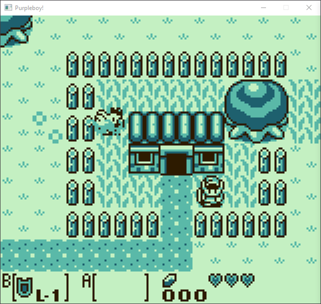

# PurpleBoy
A Gameboy emulator written in Golang to further my understanding of emulation development in general, and as a fun challenge. It's very much a 
WIP, but with the exception of sound and some MBC's, most games run fine. 
Since this was a learning project, the emulator is not cycle-accurate nor fast.

## Features
* Passable emulation of most titles
* Supports MBC1, MBC2 and MBC3 ROM mappers
* Some debug output and logging capabilities are available
* Has controller support
 
## Screenshots

Title | In-game
:-------------------------:|:-------------------------:
 | 
 | 
 | 

Debugger
:-------------------------:|
 |

# Tests
[Blaarg's Test roms](https://github.com/retrio/gb-test-roms)
cpu_instrs | cpu_timing
:-------------------------:|:-------------------------:
 | 

Purpleboy also passes all MBC1+MBC2 test roms from the [mooneye-gb test suite](https://gekkio.fi/files/mooneye-gb/latest/).

## TODO
- Add SPU
- Add support for more MBC's (namely MBC5)
- CGB support

# Resources used
All of the resources below were extremely helpful during development of the emulator
### Documentation:

- [Pandocs](https://gbdev.io/pandocs/)
- [Game Boy: Complete Technical Reference](https://gekkio.fi/files/gb-docs/gbctr.pdf)
- [GBEDG](https://hacktix.github.io/GBEDG/)
- [SM83 Opcode Decodings](https://cdn.discordapp.com/attachments/465586075830845475/742438340078469150/SM83_decoding.pdf)

### Blogs:
- [[ emudev ]](emudev.de)
- [Coffee-gb](https://blog.rekawek.eu/2017/02/09/coffee-gb/)

### Emulator Logs:
- https://github.com/wheremyfoodat/Gameboy-logs

### Other GB Emulator's Which I Referenced:
- https://github.com/wheremyfoodat/Beeg-Boy
- https://github.com/mattrberry/CryBoy

## Credits
- [wheremyfoodat](https://github.com/wheremyfoodat): An invaluable (and very patient) mentor to me throughout development and personally
helped locate pesky bugs
- The wonderful folk over at the r/emudev discord server :D

